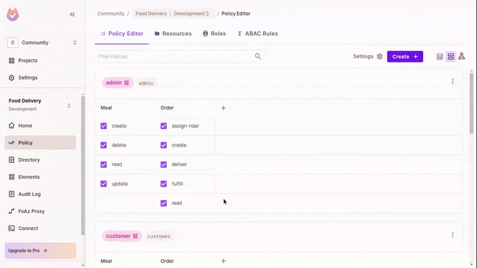
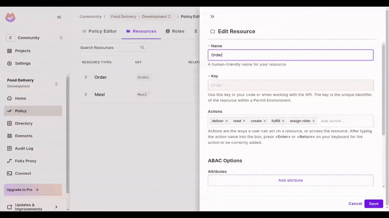
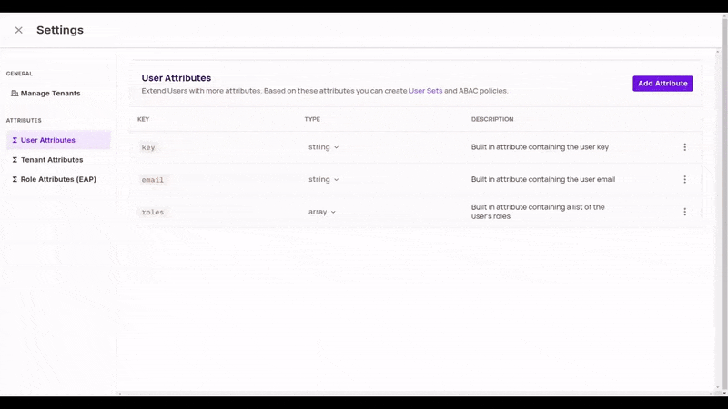
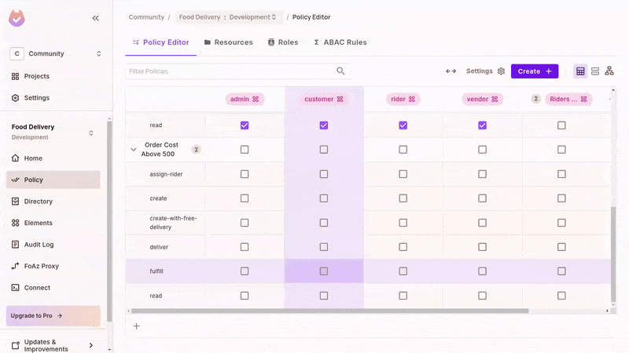
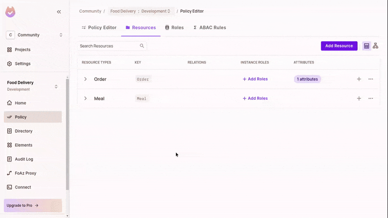

# Food Delivery Ecosystem with ABAC, ReBAC, and Permit.io

This repository contains a Nuxt.js project that demonstrates how to implement Attribute-Based Access Control (ABAC) and Relationship-Based Access Control (ReBAC) in a food delivery ecosystem. The project leverages [Permit.io](http://permit.io/) for managing and syncing users and enforcing example ABAC and ReBAC policies.

## Repo Branches

This repo has 3 branches. The code in each branch resemble each other but are slightly modified to express the particular concept being showcased. Also, splitting them like this helps you understand what's going on in a particular concept. The repo branches are as follows:

- `rbac-multitenancy`: Demonstrates Role-Based Access Control (RBAC) and Multitenancy
- `abac-rebac`: Demonstrates Attribute-Based Access Control (ABAC) and Relationship-Based Access Control (ReBAC)
- `all-features`: Demonstrates all authorization models and data syncing.

You are currently in the **`abac-rebac`** branch.

## Key Features

- **Attribute-Based Access Control (ABAC):**

  - Use properties of users and resources to check conditions for permissions
  - Example of cost amount of order to make it a free delivery order.
  - Example of number of rides by rider to make them eligible to delivery free delivery orders.

- **Relationship-Based Access Control (ReBAC):**
  
  - Use links or connections between users and resources for authorization
  - Use Order#Vendor instance role to only allow relating vendors to deliver orders.

- **Permit.io Integration:**

  - Synchronize users with Permit.io using a modal in the UI and a dedicated server endpoint.
  - Benefit from Permit.io's built-in policy enforcement.

- **Nuxt.js Server and Vue Frontend:**

  - Build the backend with Nuxt server routes powered by Nitro and h3.
  - Use Nuxt’s `$fetch` composable for API calls.
  - Manage application state with [Pinia](https://pinia.vuejs.org/).

- **UI Components:**
  - Use [PrimeVue](https://primevue.org/) for a rich, interactive interface.
  - Leverage [tailwindcss](https://tailwindcss.com/) for styling.

## Project Structure

- **/server:** Contains Nuxt server routes and middleware for handling API requests, authorization checks, and connecting to Permit.io.
- **/components:** Vue components including the navigation, OrdersDisplay, ManageMeals, and a modal for managing user roles.
- **/stores:** Pinia stores for managing state such as cities, meals, and orders.
- **/pages:** Has each Nuxt page for each role's context
- **/temp:** Temporary JSON-files-based database for Orders and Meals

## Running the Project

1. **Configure RBAC in the Permit UI:**
   - Create or use a Project in https://app.permit.io for this Food Delivery repo.
   - Create 2 resources with their actions:
      - Meal: create, read, update, and delete.
      - Order: create, read, fulfill, assign-rider, and deliver.
   - Update the Policy Editor and grant permissions for the right actions.

   

2. **Configure ABAC in the Project:**
   - Create numeric cost attribute on order.
   - Create ABAC Resource Set for Orders above 500
   - Add create-with-free-delivery action on Orders
   
   

   - Add numeric number_of_rides attribute on users at tenant settings page at https://app.permit.io/user-management/tenant-settings/user-attributes.
   - Create ABAC User Set for Riders with above 500 rides

   

   - Update Permit policy table to allow actions on the ABAC sets

   

3. **Configure ReBAC in the Project:**

   - Create Vendor instance role on the Order resource
   - Update Permit policy to allow action on instance role holders

   

4. **Clone the Repository:**
   ```bash
   git clone https://github.com/permitio/permit-nuxt-example.git
   cd permit-nuxt-example
   git checkout abac-rebac
   ```
5. **Install Dependencies:**
   ```bash
   npm install
   ```
6. **Provide Environment Variables:**
   - Obtain a Permit token from the [project settings in the Permit Console](https://app.permit.io/settings/api-keys).
   - Create a `.env` file at the root of the project with the following:
     ```bash
     PERMIT_TOKEN=permit_key_XXXXXXXXXXXXXXXXXXXXXXXXX
     PERMIT_PDP=http://localhost:7766
     ```
7. **Start a Local PDP:**
   - Run the following command to start up a local [PDP (Policy Decision Point)](https://docs.permit.io/concepts/pdp/overview/) for the ABAC & ReBAC rules. Put your permit token in the slated place.
   ```bash
   docker run -it \
    -p 7766:7000 \
    --env PDP_API_KEY=<your-permit-api-key> \
    --env PDP_DEBUG=True \
    permitio/pdp-v2:latest
   ```
8. **Run the Development Server:**
   ```bash
   npm run dev
   ```
9. **Access the App:**
   - Open [http://localhost:3000](http://localhost:3000) in your browser.
   - Grant your test user the Order#Vendor resource instance role for a given Order ID in Permit UI and test allows/denys.
